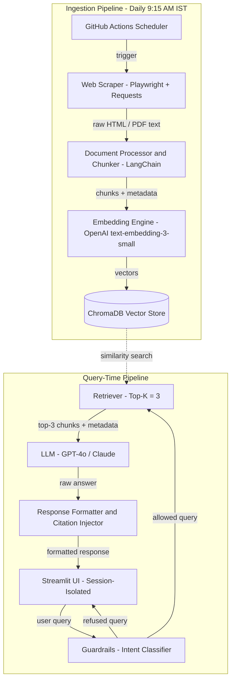
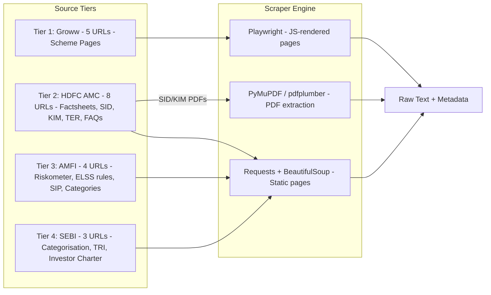
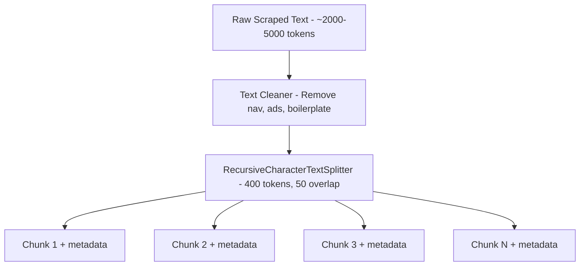
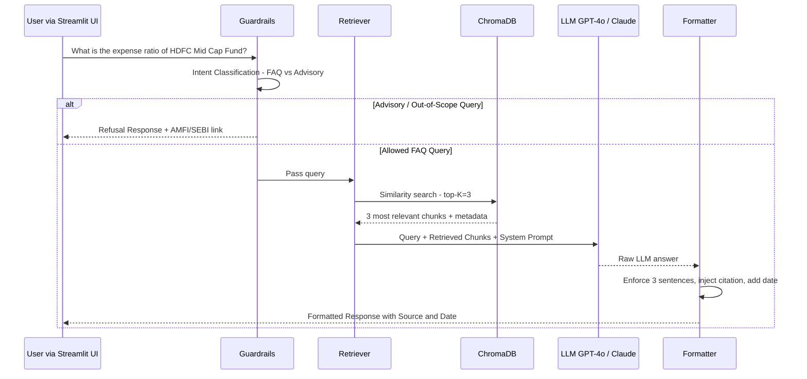
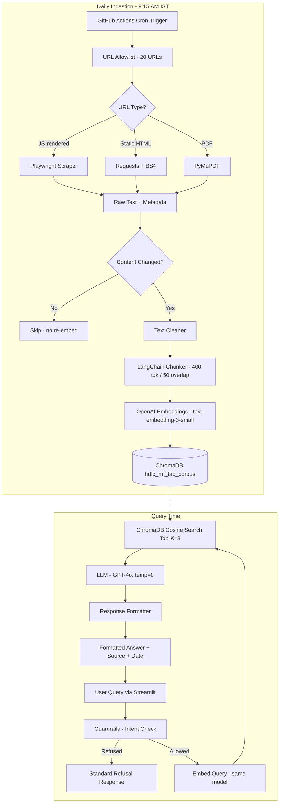

# RAG Architecture — Groww × HDFC Mutual Fund FAQ Chatbot

> **Version:** v1.0 · April 2026  
> **Confidential** · Derived from Product Problem Statement v1.0  
> **Milestone:** Milestone 1 — FAQ RAG

---

## 1. Architecture Overview

The system is a **facts-only, Retrieval-Augmented Generation (RAG)** chatbot that answers objective, verifiable questions about 5 HDFC Mutual Fund schemes available on Groww. It ingests data exclusively from 20 curated official URLs (AMC, AMFI, SEBI), stores vector embeddings in ChromaDB, and uses an LLM to synthesise concise, cited responses.

### 1.1 High-Level Pipeline

```
Scheduler → Scraper → Chunker → Embedder → Vector Store
                                                  ↓
                          User Query → Retriever → LLM → Response → UI
```

### 1.2 System Architecture Diagram



---

## 2. Component Deep-Dive

### 2.1 Scheduler

| Property | Detail |
|---|---|
| **Technology** | GitHub Actions (cron) |
| **Schedule** | `45 3 * * *` UTC → **9:15 AM IST** daily |
| **Trigger** | Automated; manual dispatch also supported |
| **Responsibility** | Invoke the ingestion pipeline, log run status, alert on failure |

**Why GitHub Actions?**  
Zero-infrastructure cost, native cron support, built-in secret management for API keys, and version-controlled workflow definitions.

---

### 2.2 Web Scraper



| Property | Detail |
|---|---|
| **Playwright** | Used **only** for Groww (Tier 1) — JavaScript-rendered SPAs |
| **Requests + BS4** | Used for static HTML pages (HDFC AMC, AMFI, SEBI) |
| **PDF Parser** | PyMuPDF or pdfplumber for SID/KIM documents |
| **URL Allowlist** | Hardcoded list of exactly 20 URLs — no crawling beyond this |
| **Retry Logic** | Exponential backoff, max 3 retries per URL |
| **Output** | Raw text + structured metadata (source URL, scrape timestamp, tier) |

#### Metadata Schema (per scraped document)

```json
{
  "source_url": "https://groww.in/mutual-funds/hdfc-mid-cap-opportunities-fund-direct-growth",
  "source_tier": "tier_1_groww",
  "scheme_name": "HDFC Mid Cap Opportunities Fund - Direct Growth",
  "category": "Mid-cap",
  "scrape_timestamp": "2026-04-14T09:15:00+05:30",
  "content_hash": "sha256:abc123...",
  "document_type": "scheme_page"
}
```

**Important:** The scraper performs a **content hash check** against the previous run. If the hash is unchanged, the document is skipped to avoid unnecessary re-embedding.

---

### 2.3 Document Processor & Chunker

| Property | Detail |
|---|---|
| **Framework** | LangChain `RecursiveCharacterTextSplitter` |
| **Chunk Size** | **400 tokens** |
| **Chunk Overlap** | **50 tokens** |
| **Metadata Preservation** | Every chunk inherits its parent document's metadata |
| **Cleaning** | Strip navigation elements, footers, ads, boilerplate |

#### Chunking Strategy



**Why 400 tokens / 50 overlap?**

- **400 tokens** keeps each chunk focused on a single fact (expense ratio, exit load, etc.), improving retrieval precision.
- **50-token overlap** ensures no fact is split across chunk boundaries without representation in at least one complete chunk.

#### Chunk Metadata Schema

```json
{
  "chunk_id": "uuid-v4",
  "parent_doc_url": "https://...",
  "source_tier": "tier_1_groww",
  "scheme_name": "HDFC Mid Cap Opportunities Fund - Direct Growth",
  "category": "Mid-cap",
  "scrape_date": "2026-04-14",
  "chunk_index": 3,
  "total_chunks": 12
}
```

---

### 2.4 Embedding Engine

| Property | Detail |
|---|---|
| **Model** | OpenAI `text-embedding-3-small` (1536 dimensions) |
| **Batch Size** | 100 chunks per API call |
| **Rate Limiting** | Respect OpenAI rate limits with backoff |
| **Fallback** | Queue failed chunks for retry on next scheduler run |

**Note:** `text-embedding-3-small` is chosen for its strong performance-to-cost ratio. For production scaling, consider `text-embedding-3-large` for improved retrieval accuracy.

---

### 2.5 Vector Store — ChromaDB

| Property | Detail |
|---|---|
| **Database** | ChromaDB (persistent mode) |
| **Collection** | `hdfc_mf_faq_corpus` |
| **Distance Metric** | Cosine similarity |
| **Storage** | Local persistent directory (`./chroma_db/`) |
| **Index Refresh** | Full re-index on content hash change; incremental otherwise |

#### Collection Structure

```
ChromaDB Collection: hdfc_mf_faq_corpus
├── Documents (chunk text)
├── Embeddings (1536-dim vectors)
├── Metadata (source_url, scheme_name, scrape_date, tier, ...)
└── IDs (chunk UUIDs)
```

**Tip:** ChromaDB supports metadata filtering. At query time, the retriever can optionally filter by `scheme_name` or `source_tier` to narrow search scope when the user's intent is clear.

---

### 2.6 Query-Time Pipeline



#### 2.6.1 Guardrails — Intent Classifier

The guardrail layer classifies every incoming query **before** it reaches the retriever.

| Classification | Action | Example Query |
|---|---|---|
| **Factual FAQ** | ✅ Proceed to retriever | "What is the expense ratio of HDFC ELSS?" |
| **Advisory / Opinion** | ❌ Refuse with standard message | "Should I invest in HDFC Mid Cap?" |
| **Comparison** | ❌ Refuse | "Is HDFC better than Nippon?" |
| **Projection / Calculation** | ❌ Refuse | "What will my SIP grow to?" |
| **PII Attempt** | ❌ Refuse + warn | "My PAN is ABCDE1234F, check my..." |
| **Out-of-Scope** | ❌ Refuse | "What's the weather today?" |

**Refusal Template:**
```
"I can only share verified facts about mutual fund schemes.
For guidance, please visit https://www.amfiindia.com or https://www.sebi.gov.in."
```

#### 2.6.2 Retriever

| Property | Detail |
|---|---|
| **Search Type** | Cosine similarity |
| **Top-K** | 3 chunks |
| **Re-ranking** | Optional — cross-encoder re-ranker for precision (future enhancement) |
| **Metadata Filter** | Optional scheme-name or tier filter based on query entity extraction |

#### 2.6.3 LLM — Response Generation

| Property | Detail |
|---|---|
| **Primary Model** | GPT-4o (OpenAI) |
| **Fallback Model** | Claude (Anthropic) |
| **Temperature** | 0.0 (deterministic, factual) |
| **Max Tokens** | 300 |
| **Context Window** | System prompt + 3 retrieved chunks + user query |

**System Prompt:**

```
You are a facts-only mutual fund FAQ assistant for HDFC Mutual Fund schemes on Groww.

RULES:
1. Answer ONLY from the provided context chunks. Never use external knowledge.
2. Never give investment advice, opinions, projections, or comparisons.
3. Keep answers to 3 sentences or fewer.
4. Always include the source URL from the chunk metadata.
5. Always include "Last updated from sources: DD MMM YYYY" using the scrape date.
6. If the context does not contain the answer, say:
   "I don't have verified information for this query. Please check [source URL]."
7. Never collect, reference, or request personal information (PAN, Aadhaar, email, phone).
```

#### 2.6.4 Response Formatter

Enforces the mandatory output structure:

```
[Answer — max 3 factual sentences]

Source: [exact URL]
Last updated from sources: DD MMM YYYY
```

---

## 3. Data Flow — End-to-End



---

## 4. UI Layer — Streamlit

| Property | Detail |
|---|---|
| **Framework** | Streamlit |
| **Session Isolation** | Each user gets an independent `st.session_state` chat history |
| **Welcome Screen** | Greeting + 3-5 sample questions + disclaimer |
| **Chat Interface** | Conversational message bubbles (user / assistant) |
| **Disclaimer** | Persistent footer disclaimer (see below) |

### UI Wireframe Structure

```
+--------------------------------------------------+
|  HDFC Mutual Fund FAQ Assistant                   |
|  Powered by Groww                                 |
+--------------------------------------------------+
|                                                   |
|  Welcome! I can answer factual questions about    |
|  HDFC Mutual Fund schemes on Groww.               |
|                                                   |
|  Try asking:                                      |
|  - What is the expense ratio of HDFC Mid Cap?     |
|  - What is the lock-in period for ELSS funds?     |
|  - How do I download my capital gains statement?  |
|                                                   |
+--------------------------------------------------+
|  Chat Area                                        |
|  +----------------------------------------------+ |
|  | User: What is the SIP minimum for            | |
|  |       HDFC Flexi Cap?                         | |
|  |                                               | |
|  | Bot: The minimum SIP for HDFC Flexi Cap       | |
|  |      Fund is Rs.100 per month.                | |
|  |                                               | |
|  |  Source: https://groww.in/...                  | |
|  |  Last updated: 14 Apr 2026                    | |
|  +----------------------------------------------+ |
|                                                   |
+--------------------------------------------------+
|  [ Type your question here...             ] [Go]  |
+--------------------------------------------------+
|  Facts-only. No investment advice. Source data     |
|  from HDFC MF, AMFI, SEBI only. No PII stored.   |
+--------------------------------------------------+
```

---

## 5. Security & Compliance

| Concern | Mitigation |
|---|---|
| **PII Protection** | No PAN, Aadhaar, email, phone collected or stored. Guardrail blocks PII in queries. |
| **Source Integrity** | Strict 20-URL allowlist — no web crawling beyond this list |
| **No Investment Advice** | Intent classifier + system prompt enforce refusal |
| **API Key Security** | Stored in GitHub Actions secrets / environment variables, never in code |
| **Data Freshness** | Content hash tracking ensures staleness is detected; scrape date shown in every response |
| **Hallucination Prevention** | Temperature = 0, context-only answers, explicit "I don't know" fallback |

---

## 6. Technology Stack Summary

| Layer | Technology | Purpose |
|---|---|---|
| **Scheduler** | GitHub Actions (cron) | Daily corpus refresh at 9:15 AM IST |
| **Scraper — JS Pages** | Playwright (Python) | Groww scheme pages (SPA) |
| **Scraper — Static Pages** | Requests + BeautifulSoup | HDFC AMC, AMFI, SEBI pages |
| **Scraper — PDFs** | PyMuPDF / pdfplumber | SID, KIM documents |
| **Chunker** | LangChain `RecursiveCharacterTextSplitter` | 400-token chunks, 50-token overlap |
| **Embeddings** | OpenAI `text-embedding-3-small` | 1536-dim vectors |
| **Vector Store** | ChromaDB (persistent) | Cosine similarity search |
| **LLM (Primary)** | GPT-4o (OpenAI) | Response generation |
| **LLM (Fallback)** | Claude (Anthropic) | Fallback generation |
| **Guardrails** | Custom Python (keyword + LLM classify) | Intent classification, PII detection |
| **UI** | Streamlit | Chat interface with session isolation |
| **Language** | Python 3.11+ | All components |

---

## 7. Directory Structure (Proposed)

```
Rag_Chatbot/
├── .github/
│   └── workflows/
│       └── daily_ingestion.yml        # GitHub Actions cron workflow
├── docs/
│   ├── RAG_Architecture.md            # This document
│   └── Problem statement.md
├── src/
│   ├── ingestion/
│   │   ├── scraper.py                 # Playwright + Requests scrapers
│   │   ├── pdf_parser.py              # PDF extraction (SID/KIM)
│   │   ├── cleaner.py                 # HTML/text cleaning
│   │   ├── chunker.py                 # LangChain chunking
│   │   └── embedder.py                # OpenAI embedding + ChromaDB store
│   ├── retrieval/
│   │   ├── retriever.py               # ChromaDB query, top-K=3
│   │   └── reranker.py                # (Optional) cross-encoder re-ranker
│   ├── generation/
│   │   ├── llm_client.py              # GPT-4o / Claude API client
│   │   ├── system_prompt.py           # System prompt template
│   │   └── formatter.py              # Response formatting + citation injection
│   ├── guardrails/
│   │   ├── intent_classifier.py       # FAQ vs Advisory classification
│   │   └── pii_detector.py            # PII blocking
│   ├── config/
│   │   ├── url_allowlist.py           # 20 curated URLs
│   │   ├── scheme_metadata.py         # 5 scheme definitions
│   │   └── settings.py                # App-wide settings
│   └── app.py                         # Streamlit entry point
├── chroma_db/                          # Persistent ChromaDB storage
├── data/
│   └── raw/                           # Raw scraped text (cached)
├── tests/
│   ├── test_scraper.py
│   ├── test_chunker.py
│   ├── test_retriever.py
│   ├── test_guardrails.py
│   └── test_e2e.py                    # End-to-end QA tests (10 sample queries)
├── requirements.txt
├── README.md
└── .env.example                       # Environment variable template
```

---

## 8. Corpus — 20 URL Breakdown

| Tier | Source | Count | Content Type | Scraper |
|---|---|---|---|---|
| **Tier 1** | Groww | 5 | Scheme pages (expense ratio, SIP, exit load) | Playwright |
| **Tier 2** | HDFC AMC | 8 | Factsheets, SID, KIM, TER, FAQs, statements, tax docs, riskometer | Requests + PDF parser |
| **Tier 3** | AMFI | 4 | Riskometer definitions, ELSS rules, SIP guide, MF categories | Requests |
| **Tier 4** | SEBI | 3 | Categorisation rules, TRI benchmark rules, investor charter | Requests |
| | | **20** | | |

### Schemes Covered

| # | Scheme | Category | Benchmark |
|---|---|---|---|
| 1 | HDFC Mid Cap Opportunities Fund – Direct Growth | Mid-cap | Nifty Midcap 150 TRI |
| 2 | HDFC Flexi Cap Fund – Direct Growth | Flexi-cap | BSE 500 TRI |
| 3 | HDFC ELSS Tax Saver Fund – Direct Growth | ELSS | Nifty 500 TRI |
| 4 | HDFC Large Cap Fund – Direct Growth | Large-cap | Nifty 100 TRI |
| 5 | HDFC Small Cap Fund – Direct Growth | Small-cap | Nifty Smallcap 250 TRI |

---

## 9. Query Types & Expected Behavior

| Query Type | Example | Expected Behavior |
|---|---|---|
| Expense Ratio | "What is the expense ratio of HDFC Mid Cap Fund?" | ✅ Factual answer + source + date |
| Exit Load | "What is the exit load for HDFC Large Cap?" | ✅ Factual answer + source + date |
| Minimum SIP | "What's the minimum SIP for HDFC Flexi Cap?" | ✅ Factual answer + source + date |
| ELSS Lock-in | "What is the lock-in period for ELSS funds?" | ✅ Factual answer + source + date |
| Riskometer | "What is the riskometer rating of HDFC Small Cap?" | ✅ Factual answer + source + date |
| Benchmark | "What is the benchmark index for HDFC Flexi Cap?" | ✅ Factual answer + source + date |
| Statement Download | "How do I download my capital gains statement?" | ✅ Factual answer + source + date |
| Investment Advice | "Should I invest in HDFC ELSS or Large Cap?" | ❌ Refusal message |
| Return Comparison | "Which fund gave best returns?" | ❌ Refusal message |
| Timing Advice | "Is now a good time to invest?" | ❌ Refusal message |
| SIP Calculator | "What will my SIP grow to?" | ❌ Refusal message |
| AMC Comparison | "Is HDFC better than Nippon?" | ❌ Refusal message |

---

## 10. Known Limitations

| Limitation | Impact | Mitigation |
|---|---|---|
| Groww pages are JavaScript-rendered SPAs | Requires Playwright (slower, heavier) | Headless browser with optimized wait strategies |
| SID/KIM are PDF documents | Complex parsing, layout-sensitive | PyMuPDF with fallback to pdfplumber |
| Factsheets may be up to 30 days old | Staleness in data | Show `Last updated` date on every response |
| No live NAV or AUM data | Cannot answer real-time pricing queries | Explicit refusal for live data queries |
| Only 5 schemes supported | Limited coverage | Clearly stated scope; refuse queries about other schemes |
| English only | No multi-language support | Future enhancement for Hindi/regional languages |

---

## 11. Future Enhancements (Post-Milestone 1)

| Enhancement | Description |
|---|---|
| **Cross-encoder re-ranking** | Add a re-ranker after initial retrieval for higher precision |
| **Hybrid search** | Combine dense (vector) + sparse (BM25) retrieval |
| **Expand scheme coverage** | Support all HDFC schemes, then multi-AMC |
| **Multi-language** | Hindi and regional language support |
| **Live NAV integration** | Real-time NAV via AMFI daily NAV API |
| **Feedback loop** | User thumbs-up/down to improve retrieval quality |
| **Caching layer** | Cache frequent queries to reduce LLM API calls |
| **Observability** | LangSmith / LangFuse for tracing and evaluation |

---

> **Note:** This architecture is designed for **Milestone 1 — FAQ RAG** and is scoped to 5 HDFC schemes with 20 curated URLs. All design decisions prioritize **factual accuracy**, **source traceability**, and **hallucination prevention** over breadth of coverage.

---

*Facts-only. No investment advice. Source data from HDFC Mutual Fund, AMFI, and SEBI official pages only. Last updated from sources shown on each response. This assistant does not store any personal information.*
